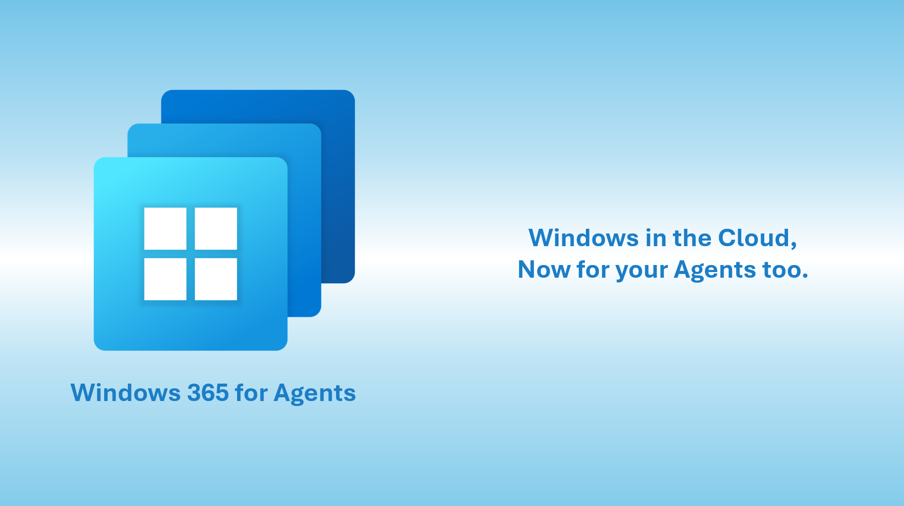

<div align="center">

# Windows 365 for Agents

**Run AI agents in secure, scalable Cloud PCs.**


<div align="center">
  
</div>


[](https://learn.microsoft.com/en-us/windows-365/public-preview)
[](./LICENSE.md) [](./W365A-Playground-Agent/LICENSE)
[](https://www.python.org/)
[](https://modelcontextprotocol.io)

[Documentation](./docs/) · [Quick Start](#quick-start) · [API Reference](./docs/api-reference.md) · [Examples](./docs/quickstart.md)

</div>

---

## What is Windows 365 for Agents?

Windows 365 for Agents provides Cloud PCs for AI agent workloads — fully managed, Entra ID-joined, Intune-governed virtual Windows desktops in the Microsoft Cloud. Agents check out a Cloud PC from a shared pool, perform tasks using keyboard, mouse, browser, and shell automation, then check the Cloud PC back in for reuse.

Built on the [Windows 365](https://learn.microsoft.com/en-us/windows-365/overview) platform. Controlled via [Model Context Protocol (MCP)](https://modelcontextprotocol.io).

## Key Features

- 🖥️ **Secure Cloud PCs** — Entra ID-joined, Intune-managed, governed by enterprise security policies
- 🔄 **Check-in / Check-out model** — Agents reserve a Cloud PC per task and return it when done
- 🤖 **54 MCP tools** — Desktop automation, browser control, accessibility, shell commands
- 👁️ **Real-time screen sharing** — Human-in-the-loop observation and takeover via WebRTC
- 🏢 **Enterprise-grade** — Conditional Access, compliance, audit trails built in
- ⚡ **Pool-based scaling** — Provision pools of Cloud PCs; agents request capability, not specific machines

## Documentation

| Topic | Description |
|-------|-------------|
| [Overview](./docs/overview.md) | What is Windows 365 for Agents, platform capabilities, supported regions |
| [Quick Start](./docs/quickstart.md) | Step-by-step guide: prerequisites → first agent session |
| [Architecture](./docs/architecture.md) | Four-plane architecture: Create, Get, Do, See |
| [Session Lifecycle](./docs/sessions.md) | Prepare → Acquire → Connect → Act → Release |
| [Cloud PC Pools](./docs/cloud-pc-pools.md) | Pool concepts, status, management |
| [Provisioning](./docs/provisioning.md) | Create and manage provisioning policies in Intune |
| [API Reference](./docs/api-reference.md) | Session checkout/checkin, MCP, screen sharing endpoints |
| [MCP Tools](./docs/mcp-tools.md) | All 62 built-in tools: desktop, browser, accessibility |
| [Screen Sharing](./docs/screen-sharing.md) | Human-in-the-loop observation and shared control |
| [Security](./docs/security.md) | Identity, Entra integration, Zero Trust, authentication |
| [FAQ](./docs/faq.md) | Common questions and troubleshooting |

## Architecture at a Glance

```
┌─────────────────────────────────────────────────────────────┐
│                     Entry Points                            │
│  ┌──────────┐   ┌──────────────┐   ┌──────────────────┐    │
│  │  Chat UX │   │  Agent App   │   │  IT Admin Portal │    │
│  └────┬─────┘   └──────┬───────┘   └────────┬─────────┘    │
│       │                │                     │              │
├───────┼────────────────┼─────────────────────┼──────────────┤
│       │                │                     │              │
│       │         ┌──────▼───────┐    ┌────────▼──────────┐   │
│       │         │ Computer-Get │    │  Computer-Create   │   │
│       │         │  (Sessions)  │    │  (Provisioning)    │   │
│       │         │  Check-out   │    │  Cloud PC Pools    │   │
│       │         │  Check-in    │    │  Policy & Billing  │   │
│       │         └──────┬───────┘    └───────────────────┘   │
│       │                │                                    │
│  ┌────▼────────────────▼────────┐                           │
│  │        Cloud PC (VM)         │                           │
│  │  ┌────────────┐ ┌─────────┐  │                           │
│  │  │Computer-Do │ │Computer-│  │                           │
│  │  │ (MCP Tools)│ │  See    │  │                           │
│  │  │ 62 tools   │ │(Screen  │  │                           │
│  │  │ Desktop,   │ │ Share)  │  │                           │
│  │  │ Browser,   │ │ WebRTC  │  │                           │
│  │  │ A11y       │ │         │  │                           │
│  │  └────────────┘ └─────────┘  │                           │
│  └──────────────────────────────┘                           │
└─────────────────────────────────────────────────────────────┘
```

## Quick Start

> **Prerequisites:** An Entra ID app registration and a provisioned Cloud PC agent pool. See [Getting Started](./docs/quickstart.md) for full setup.

```python
import httpx
import json
import uuid

# --- Configuration ---
TENANT_ID     = "your-tenant-id"
CLIENT_ID     = "your-app-client-id"
CLIENT_SECRET = "your-app-secret"
POOL_ID       = "your-pool-id"
USER_OID      = "your-aad-user-object-id"
REGION        = "canadacentral"  # Test regions: canadacentral, eastus2
SESSION_BASE  = f"https://{REGION}.sessionmanagement.regional.cloudinferenceplatform.azure-test.net"

# 1. Acquire token
token_resp = httpx.post(
    f"https://login.microsoftonline.com/{TENANT_ID}/oauth2/v2.0/token",
    data={
        "client_id": CLIENT_ID,
        "client_secret": CLIENT_SECRET,
        "scope": "api://W365Agents-Int/.default",  # Test/Int audience
        "grant_type": "client_credentials",
    },
)
TOKEN = token_resp.json()["access_token"]

# 2. Checkout session (reserves a Cloud PC)
session_id = str(uuid.uuid4())
checkout = httpx.post(
    f"{SESSION_BASE}/api/pools/{POOL_ID}/sessions",
    params={"api-version": "2.0"},
    headers={
        "Authorization": f"Bearer {TOKEN}",
        "user-object-id": USER_OID,
        "x-ms-sessionId": session_id,      # Idempotency key — always include
    },
    timeout=35.0,
)
session = checkout.json()
computer_url = session["computerUrl"]
computer_id  = computer_url.split("/computers/")[1]

# 3. Initialize MCP (required once per session)
MCP_ENDPOINT = f"{computer_url}/mcp"
MCP_HEADERS  = {
    "Authorization": f"Bearer {TOKEN}",
    "x-ms-computerId": computer_id,
    "Content-Type": "application/json",
}

def mcp_call(method, params=None, msg_id=1):
    body = {"jsonrpc": "2.0", "id": msg_id, "method": method}
    if params:
        body["params"] = params
    resp = httpx.post(MCP_ENDPOINT, headers=MCP_HEADERS,
                      params={"api-version": "1.0"},
                      content=json.dumps(body), timeout=35.0)
    return resp.json()

mcp_call("initialize", {
    "protocolVersion": "2024-11-05",
    "capabilities": {},
    "clientInfo": {"name": "MyAgent", "version": "1.0"},
})

# 4. Take a screenshot
screenshot = mcp_call("tools/call",
    {"name": "take_screenshot", "arguments": {}}, msg_id=2)
print(screenshot)

# 5. Click at coordinates
mcp_call("tools/call",
    {"name": "click", "arguments": {"x": 500, "y": 300}}, msg_id=3)

# 6. Checkin (release the Cloud PC)
httpx.delete(
    f"{SESSION_BASE}/api/sessions/{session_id}",
    params={"api-version": "2.0"},
    headers={"Authorization": f"Bearer {TOKEN}"},
)
```

## Samples

| Sample | Language | Description |
|--------|----------|-------------|
| [W365A Playground Agent](./W365A-Playground-Agent/) | C# / .NET 8 | Teams-connected agent with Cloud PC Computer Use, screenshot forwarding, and MCP tool integration |

## Getting Help

- 📖 [Full documentation](./docs/)
- 🐛 [Report an issue](../../issues)
- 💬 [Discussions](../../discussions)
- 📚 [Microsoft Learn: Windows 365](https://learn.microsoft.com/en-us/windows-365/)

## Contributing

We welcome contributions! See [CONTRIBUTING.md](./CONTRIBUTING.md) for guidelines.

This project has adopted the [Microsoft Open Source Code of Conduct](https://opensource.microsoft.com/codeofconduct/).
See [CODE_OF_CONDUCT.md](./CODE_OF_CONDUCT.md) for details.

## License

Documentation (this repo's docs, README, images, and other non-code assets) is licensed under [CC-BY-4.0](./LICENSE.md). The code in [`W365A-Playground-Agent/`](./W365A-Playground-Agent/) is licensed under the [MIT License](./W365A-Playground-Agent/LICENSE).
