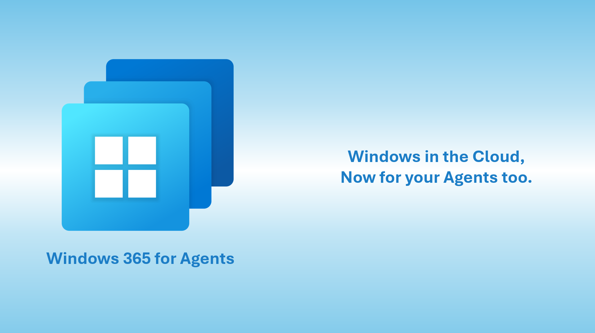

<div align="center">

# Windows 365 for Agents

**Run AI agents in secure, scalable Cloud PCs.**


<div align="center">
  
</div>


[](https://learn.microsoft.com/en-us/windows-365/agents/cloud-pc-agent-pools)
[](./LICENSE.md) [](./W365A-Playground-Agent/LICENSE)
[](https://www.python.org/)
[](https://modelcontextprotocol.io)

[Documentation](./docs/) · [Getting Started](./docs/getting-started.md) · [Quick Start](#quick-start) · [API Reference](./docs/api-reference.md)

</div>

---

## What is Windows 365 for Agents?

Windows 365 for Agents provides Cloud PCs for AI agent workloads — fully managed, Entra ID-joined, Intune-governed virtual Windows desktops in the Microsoft Cloud. Agents check out a Cloud PC from a shared pool, perform tasks using keyboard, mouse, browser, and shell automation, then check the Cloud PC back in for reuse.

Built on the [Windows 365](https://learn.microsoft.com/en-us/windows-365/overview) platform. Controlled via [Model Context Protocol (MCP)](https://modelcontextprotocol.io).

## Key Features

- 🖥️ **Secure Cloud PCs** — Entra ID-joined, Intune-managed, governed by enterprise security policies
- 🔄 **Check-in / Check-out model** — Agents reserve a Cloud PC per task and return it when done
- 🤖 **65 MCP tools** — 3 session-management tools plus 26 desktop tools (mouse/keyboard, windows, processes, shell, Python) and 36 browser tools (navigation, DOM interaction, accessibility refs, batch actions)
- 👁️ **Real-time screen sharing** — Human-in-the-loop observation and takeover via WebRTC, embedded with the integrated screen-share SDK
- 🏢 **Enterprise-grade** — Conditional Access, compliance, audit trails built in
- ⚡ **Pool-based scaling** — Provision pools of Cloud PCs; agents request capability, not specific machines

## Documentation

| Topic | Description |
|-------|-------------|
| [Overview](./docs/overview.md) | What is Windows 365 for Agents, platform capabilities, supported regions |
| [Getting Started](./docs/getting-started.md) | The onboarding flow: Understand → Prerequisites → Set up → Build → Validate → Manage → Troubleshoot, ending with your first Computer-Use call |
| [Architecture](./docs/architecture.md) | Four-plane architecture: Create, Get, Do, See |
| [Session Lifecycle](./docs/sessions.md) | Prepare → Acquire → Connect → Act → Release |
| [Cloud PC Pools & Provisioning](./docs/cloud-pc-pools.md) | Pool concepts, status, and creating/managing pools in Intune (backed by Microsoft Graph) |
| [Authentication](./docs/authentication.md) | The agent-user token your agent sends, and the A365 identity model |
| [API Reference](./docs/api-reference.md) | The A365 tooling gateway (ATG) surface: acquire/release a Cloud PC, status, and tool calls |
| [MCP Tools](./docs/mcp-tools.md) | All 65 tools: session management, desktop, browser, accessibility |
| [Screen Sharing](./docs/screen-sharing.md) | The integrated screen-share SDK for human-in-the-loop observation and shared control |
| [Security](./docs/security.md) | Identity, Entra integration, Zero Trust, governance |
| [FAQ](./docs/faq.md) | Common questions and troubleshooting |

## Architecture at a Glance

```
┌─────────────────────────────────────────────────────────────┐
│                     Entry Points                            │
│  ┌──────────┐   ┌──────────────┐   ┌──────────────────┐    │
│  │  Chat UX │   │  Agent App   │   │  IT Admin Portal │    │
│  └────┬─────┘   └──────┬───────┘   └────────┬─────────┘    │
│       │                │                     │              │
├───────┼────────────────┼─────────────────────┼──────────────┤
│       │                │                     │              │
│       │         ┌──────▼───────┐    ┌────────▼──────────┐   │
│       │         │ Computer-Get │    │  Computer-Create   │   │
│       │         │  (Sessions)  │    │  (Provisioning)    │   │
│       │         │  Check-out   │    │  Cloud PC Pools    │   │
│       │         │  Check-in    │    │  Policy & Billing  │   │
│       │         └──────┬───────┘    └───────────────────┘   │
│       │                │                                    │
│  ┌────▼────────────────▼────────┐                           │
│  │        Cloud PC (VM)         │                           │
│  │  ┌────────────┐ ┌─────────┐  │                           │
│  │  │Computer-Do │ │Computer-│  │                           │
│  │  │ (MCP Tools)│ │  See    │  │                           │
│  │  │ 65 tools   │ │(Screen  │  │                           │
│  │  │ Desktop,   │ │ Share)  │  │                           │
│  │  │ Browser,   │ │ WebRTC  │  │                           │
│  │  │ A11y       │ │         │  │                           │
│  │  └────────────┘ └─────────┘  │                           │
│  └──────────────────────────────┘                           │
└─────────────────────────────────────────────────────────────┘
```

## Quick Start

> **Prerequisites:** an Agent 365 (A365) agent blueprint published in Entra with the Windows 365 Computer-Use MCP server added and consented, plus a provisioned Cloud PC agent pool. The [Getting Started](./docs/getting-started.md) guide walks the full setup step by step.

Windows 365 for Agents builds on **A365 identity and tooling**. Your agent authenticates as an A365 agent user and reaches the Computer-Use tools through the A365 tooling gateway (ATG). The simplest path is to register the Computer-Use MCP server with the [Agent 365 SDK](https://learn.microsoft.com/en-us/microsoft-agent-365/developer/agent-365-sdk?tabs=python): it performs the token exchange and the MCP handshake for you, then exposes the tools to your orchestrator.

Once the tools are registered, the Windows 365 specific runtime loop is **acquire a Cloud PC, wait for `Ready`, call tools, release**. Tools such as `take_screenshot`, `click`, and `type_text` are built in; see [MCP Tools](./docs/mcp-tools.md) for the full catalog.

For a complete, runnable implementation, see the [Windows 365 for Agents Playground](./W365A-Playground-Agent/) sample and its [step-by-step tutorial](./W365A-Playground-Agent/step-by-step-tutorial.md).

Prefer plain MCP over HTTP instead of the full SDK? The ATG exposes a standard MCP surface, so a thin client plus the agent-user bearer works too. See [Getting Started](./docs/getting-started.md) and the [API Reference](./docs/api-reference.md).

## Samples

| Sample | Language | Description |
|--------|----------|-------------|
| [W365A Playground Agent](./W365A-Playground-Agent/) | C# / .NET 10 | Teams-connected agent with Cloud PC Computer Use, screenshot forwarding, and MCP tool integration |

## Getting Help

- 📖 [Full documentation](./docs/)
- 🐛 [Report an issue](../../issues)
- 💬 [Discussions](../../discussions)
- 📚 [Microsoft Learn: Windows 365](https://learn.microsoft.com/en-us/windows-365/)

## Contributing

We welcome contributions! See [CONTRIBUTING.md](./CONTRIBUTING.md) for guidelines.

This project has adopted the [Microsoft Open Source Code of Conduct](https://opensource.microsoft.com/codeofconduct/).
See [CODE_OF_CONDUCT.md](./CODE_OF_CONDUCT.md) for details.

## License

Documentation (this repo's docs, README, images, and other non-code assets) is licensed under [CC-BY-4.0](./LICENSE.md). The code in [`W365A-Playground-Agent/`](./W365A-Playground-Agent/) is licensed under the [MIT License](./W365A-Playground-Agent/LICENSE).
